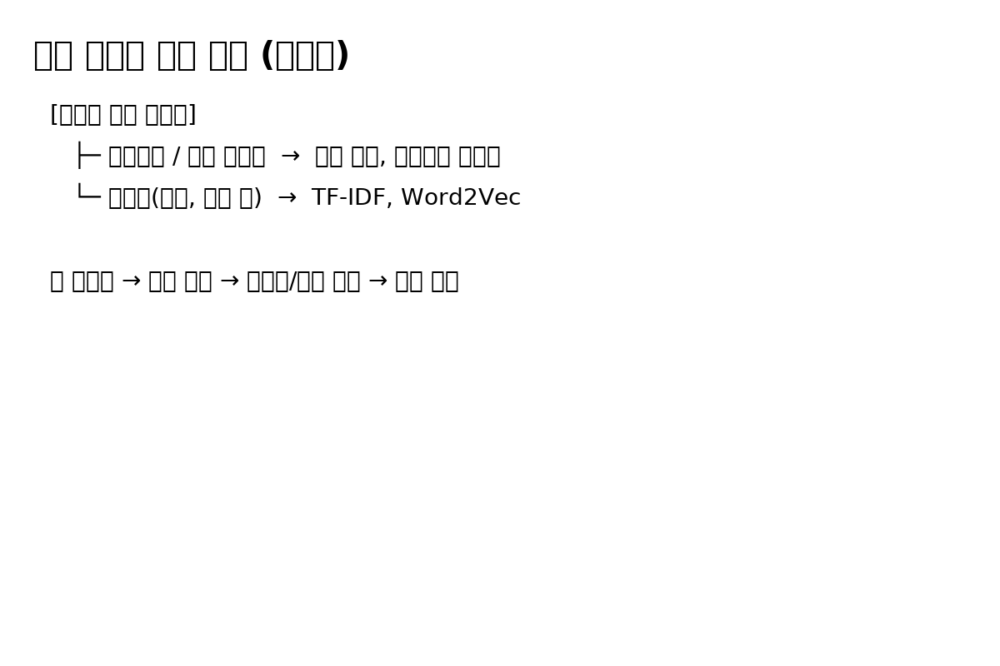
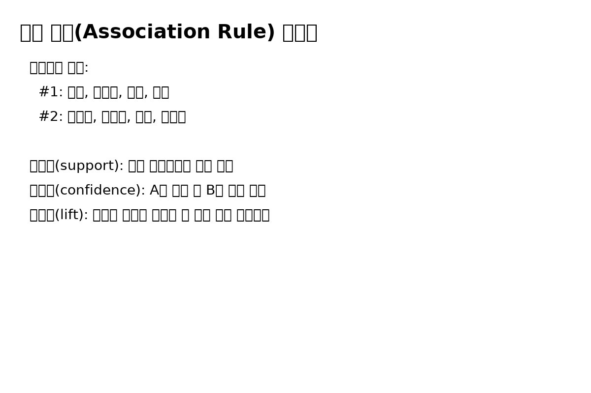
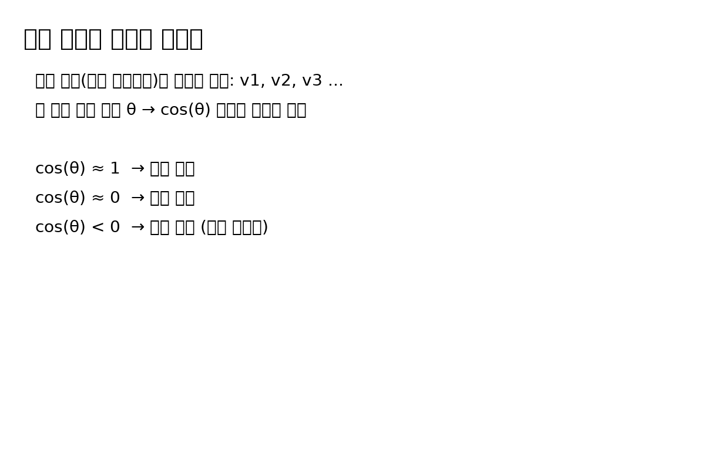
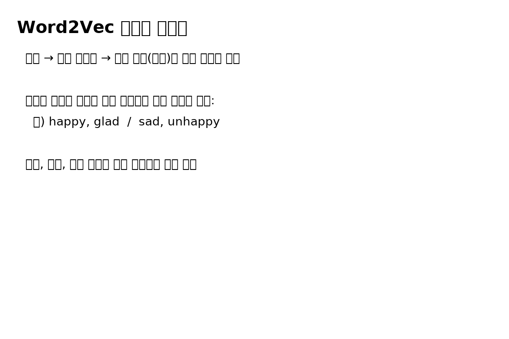

## 1. 개요

1. **장바구니(거래) 데이터 → 연관 규칙(Apriori) → “함께 사면 좋은 상품” 추천**
2. **TransactionEncoder + 코사인 유사도 → 장바구니 간 유사도 계산 → 비슷한 장바구니 기반 추천**
3. **TF-IDF + 코사인 유사도 → 문서 간 유사도 계산 → 콘텐츠 기반 추천의 기초**
4. **Word2Vec → 특정 단어 앞·뒤에 올 가능성이 높은 단어 추천 → 임베딩 기반 추천 아이디어**

이 노트북을 통해:

- “**어떤 데이터를 어떻게 벡터로 바꾸고**”
- “그 벡터로 **어떤 유사도를 계산해서 추천에 연결하는지**”

를 직관적으로 이해하는 것이 목표입니다.

---

## 2. 폴더 구조 및 관련 파일(예시)

> README는 이 이미지들을 `` 형식으로 삽입해 두었습니다.

---

## 3. 필요한 라이브러리 및 환경

노트북에서 사용하는 주요 라이브러리는 다음과 같습니다.

* **기본 라이브러리**

  * `numpy`
  * `pandas`
  * `matplotlib`

* **연관 분석 / 전처리**

  * `mlxtend`

    * `mlxtend.preprocessing.TransactionEncoder`
    * `mlxtend.frequent_patterns.apriori`

* **텍스트 벡터화 및 유사도**

  * `scikit-learn`

    * `sklearn.feature_extraction.text.TfidfVectorizer`
    * `sklearn.metrics.pairwise.cosine_similarity`, `euclidean_distances`

* **단어 임베딩**

  * `gensim`

    * `gensim.models.Word2Vec`

### 3.1. 설치 예시 (로컬)

```bash
pip install numpy pandas matplotlib
pip install mlxtend
pip install scikit-learn
pip install gensim
```

### 3.2. 실행 방법

1. Jupyter Notebook / JupyterLab / VS Code / Colab 등에서
   `다양한추천알고리즘-수업중생성.ipynb` 파일을 엽니다.
2. 상단부터 순서대로 셀을 실행하면서,
   출력 값과 그림, 주석을 하나씩 확인합니다.
3. 중간에 나오는 **“문제” 코멘트**(예: "장바구니 1번과 제일 유사도가 높은 장바구니를 찾아서…")는
   직접 코드로 채워 넣어보는 실습용 구간입니다.

---

## 4. 추천 시스템 이론 – 큰 그림


```mermaid
flowchart LR
    A[사용자 행동 데이터] --> B1[장바구니(거래) 데이터]
    A --> B2[텍스트(문장, 리뷰) 데이터]

    B1 --> C1[연관 규칙(Apriori)]
    B1 --> C2[장바구니 벡터화 + 코사인 유사도]

    B2 --> C3[TF-IDF 벡터화 + 코사인 유사도]
    B2 --> C4[Word2Vec 단어 임베딩]

    C1 --> D[추천 결과: 함께 사면 좋은 상품]
    C2 --> D
    C3 --> D
    C4 --> D
```

그리고 README 상단에는 전체 구조를 요약한 이미지를 하나 둘 수 있습니다.

```markdown

```

이 그림/이미지에서 중요한 포인트는:

* **데이터 형태**에 따라

  * 거래/장바구니 → **연관 규칙**, **장바구니 간 유사도**
  * 텍스트 → **TF-IDF**, **Word2Vec**
* **벡터 표현(행렬)**을 만든 뒤

  * **유사도/지지도**를 계산하고
  * 그 결과를 **추천**으로 연결한다는 점입니다.

---

## 5. 연관 규칙 기반 추천 (Apriori)

### 5.1. 이론 개요

**연관 규칙(Association Rule)**은
“어떤 물건 A를 산 사람은 B도 같이 사는 경향이 있다”를
**지지도(support), 신뢰도(confidence), 향상도(lift)** 같은 지표로 수치화하는 방법입니다.

대표적인 예:

* “기저귀를 산 사람은 맥주를 함께 살 확률이 높다”
* “우유와 쥬스를 같이 사는 사람에게 쿠키를 추천하자”

노트북에서는 다음 과정을 보여줍니다.

1. **장바구니 데이터 생성**

   ```python
   data = np.array([
       ['우유', '기저귀', '쥬스', '감자'],
       ['양상추', '기저귀', '맥주', '고구마'],
       ['우유', '양상추', '기저귀', '쥬스'],
       ['양상추', '맥주', '물', '쿠키']
   ])
   ```

2. **TransactionEncoder로 One-hot 인코딩**

   ```python
   from mlxtend.preprocessing import TransactionEncoder

   te = TransactionEncoder()
   te_ary = te.fit(data).transform(data)
   df = pd.DataFrame(te_ary, columns=te.columns_)
   ```

3. **Apriori 알고리즘으로 빈발 항목 집합 추출**

   ```python
   from mlxtend.frequent_patterns import apriori

   result = apriori(df, min_support=0.5, use_colnames=True)
   ```

4. **특정 아이템 조합을 기준으로 추천할 아이템 찾기**

   * 예: `['우유', '쥬스']`와 자주 같이 등장하는 나머지 아이템 찾기

이때 생각해야 하는 개념:

* **지지도(support)**:
  전체 거래 중에서 해당 아이템 집합이 등장한 비율
* **신뢰도(confidence)**:
  {A}를 산 거래 중에서 {B}도 함께 있는 비율
* **향상도(lift)**:
  A, B의 동시 등장 빈도가 “서로 독립일 때 기대값”보다 얼마나 높은지

### 5.2. 개념 그림(이미지 예시)

```markdown

```

이미지 내용 예:

* 왼쪽: 장바구니 테이블 (장바구니 ID, 구매 상품 리스트)
* 가운데: “빈발 항목 집합” 추출
* 오른쪽: “A → B” 형태의 규칙, support/confidence/lift 표시

---

## 6. 벡터 공간 + 코사인 유사도 기반 추천

노트북에서는 **두 가지 벡터 공간**을 다룹니다.

1. **문장(영문) → TF-IDF 벡터 → 문서 간 유사도**
2. **장바구니 → one-hot 벡터 → 장바구니 간 유사도**

핵심은 **“모든 대상을 숫자 벡터로 표현한 뒤, 코사인 유사도로 비교한다”**는 점입니다.

### 6.1. TF-IDF 기반 문서 유사도

1. 간단한 영어 문장을 준비합니다.

   ```python
   doc = [
       'you say goodbye and I say hello',
       'i say happy or he said white',
       'we say unhappy and angry black'
   ]
   ```

2. `TfidfVectorizer`로 벡터화합니다.

   ```python
   from sklearn.feature_extraction.text import TfidfVectorizer

   tfidf = TfidfVectorizer(stop_words='english')
   tfidf_matrix = tfidf.fit_transform(doc)
   ```

   * 행(row): 문서(문장)
   * 열(column): 단어(특징)
   * 값(value): TF-IDF 가중치

3. 문서 간 코사인 유사도를 계산합니다.

   ```python
   from sklearn.metrics.pairwise import cosine_similarity

   cosine_similarity(tfidf_matrix, tfidf_matrix)
   ```

   * 결과는 **3×3 행렬** (문서 3개이므로)
   * (1,2), (1,3), (2,3) 위치의 값이 각각 문서 쌍의 유사도

### 6.2. 장바구니 벡터 + 코사인 유사도

1. 앞에서 만든 장바구니 one-hot 데이터프레임 `df`를 그대로 사용합니다.

2. 코사인 유사도를 구합니다.

   ```python
   cosine_similarity(df, df)
   ```

3. 각 장바구니 쌍의 유사도를 바(bar) 그래프로 시각화합니다.

   ```python
   basket_name = ['1번 + 2번', '1번 + 3번', '1번 + 4번',
                  '2번 + 3번', '2번 + 4번', '3번 + 4번']
   similar = [0.33, 0.87, 0.00, 0.58, 0.82, 0.35]

   basket_df = pd.DataFrame({'basket_name': basket_name,
                             'similar': similar})

   plt.bar(basket_df['basket_name'],
           basket_df['similar'],
           align='edge',
           edgecolor='black',
           linewidth=5,
           color=colors)
   ```

4. `basket_cosine[0]`, `basket_cosine[3]` 등으로
   특정 장바구니와 다른 장바구니들의 유사도를 확인하고,
   그 중 가장 유사한 장바구니를 찾아 **추천 후보**를 결정합니다.

### 6.3. 코사인 유사도 개념 그림

```markdown

```

이미지 내용 예:

* 원점에서 시작하는 두 벡터 v1, v2
* 벡터 사이의 각도 θ
* **cos θ**가 1에 가까울수록 유사도가 높음을 강조

---

## 7. Word2Vec 기반 단어 임베딩과 추천 아이디어

노트북 후반부에서는 **Word2Vec**을 이용해
특정 단어 앞·뒤에 나올 법한 단어를 찾는 실습을 합니다.

### 7.1. 데이터 준비

```python
from gensim.models import Word2Vec

doc = [
    'you say goodbye and I say hello',
    'i say happy or he said white',
    'we say unhappy and angry black'
]

doc2 = [
    '나는 굿바이라고 했고, 너는 헬로우라고 했어.',
    '나는 기쁘다고 했고, 너는 하얗게 슬프다고 했어.',
    '우리는 행복하지 않고, 블랙으로 슬퍼'
]

sentences = [sentence.split(' ') for sentence in doc]
sentences2 = [sentence.split(' ') for sentence in doc2]
```

### 7.2. Word2Vec 모델 학습

```python
model = Word2Vec(window=1, min_count=1)
model.build_vocab(sentences)

model2 = Word2Vec(window=1, min_count=1)
model2.build_vocab(sentences2)
```

* `window=1` : 중심 단어 기준으로 앞뒤 1개 단어만 문맥으로 사용
* `min_count=1` : 등장 빈도가 1 이상인 단어만 학습에 사용

### 7.3. 유사 단어/문맥 단어 확인

```python
model.wv.most_similar('say')
model.wv.most_similar('or')
model2.wv.most_similar('너는')
```

주석에서 설명하듯,

* `'or'` 앞에는 `'say'`가, 뒤에는 `'black'`이 잘 나온다든지,
* `'너는'` 앞에는 `'굿바이라고'`, 뒤에는 `'헬로우라고'` 등
  실제 문장 패턴을 반영한 **“다음에 나올 가능성이 높은 단어”**를 찾아줍니다.

이것을 응용하면:

* 특정 상품을 “단어”처럼 생각하고 → 같이 등장하는 상품을 “문맥”으로 간주하면,
* Word2Vec으로 **상품 임베딩 벡터**를 만들고,
* `most_similar`로 **비슷한 상품 / 함께 본 상품**을 추천하는 구조를 만들 수 있습니다.

### 7.4. 단어 임베딩 시각화 이미지 예시

```markdown

```

이미지 내용 예:

* 2차원 평면 상에 `hello, goodbye, happy, unhappy, black, white` 등의 단어가 찍혀 있고
* 의미가 비슷한 단어끼리 **가까이 모여 있는 모습**을 표현

---

## 8. 노트북 실습 흐름 요약

이 노트북에서 해보는 핵심 실습들을 정리해 보면 다음과 같습니다.

1. **장바구니 → One-hot → Apriori**

   * 장바구니별 구매 상품 목록을 TransactionEncoder로 인코딩
   * Apriori로 빈발 항목 집합과 연관 규칙을 찾고,
   * 특정 조합(예: 우유+쥬스)에 대해 “함께 사면 좋은 상품”을 도출

2. **장바구니 → One-hot → 코사인 유사도**

   * 각 장바구니를 벡터로 보고,
   * 장바구니 간 유사도를 계산해,
   * “가장 비슷한 장바구니를 가진 다른 사용자”를 기반으로 추천

3. **문장 → TF-IDF → 문서 유사도**

   * 간단한 영어 문장을 TF-IDF로 벡터화하고,
   * 문서 간의 코사인 유사도를 계산해,
   * 어떤 문서끼리 내용이 비슷한지를 수치로 확인

4. **문장 → Word2Vec → 단어 임베딩**

   * 짧은 영어/한글 문장을 Word2Vec으로 학습하고,
   * 특정 단어와 함께 자주 등장하는 단어를 `most_similar`로 확인
   * 향후 “상품·콘텐츠 임베딩”으로 확장할 수 있는 아이디어를 체험

---

## 9. 이론적으로 추천 시스템을 분류해 보면

이 노트북에서 다루는 내용들을
일반적인 추천 시스템 분류와 연결하면 다음과 같이 볼 수 있습니다.

1. **연관 규칙 기반 추천**

   * 장바구니 데이터에서 **함께 자주 등장하는 아이템**을 찾는 방식
   * 예: “우유 + 쥬스 구매 고객에게 쿠키 추천”

2. **콘텐츠 기반 필터링(벡터 + 유사도)**

   * TF-IDF와 코사인 유사도는 **문서의 내용(콘텐츠)**에 기반해 비슷한 항목을 찾는 방식
   * 상품의 설명, 태그, 리뷰 텍스트를 TF-IDF로 벡터화하면,

     * “비슷한 설명/키워드를 가진 상품”을 추천할 수 있음

3. **협업 필터링(아이템/사용자 간 유사도)**

   * 장바구니를 벡터로 보고 **장바구니(사용자) 간 유사도**를 구해 추천하는 부분은
   * 간단한 형태의 **협업 필터링 아이디어**와 연결 가능

     * “나와 비슷한 장바구니를 가진 사용자가 산 다른 상품”을 추천

4. **임베딩/딥러닝 기반 추천**

   * Word2Vec은 본래 자연어 처리용이지만,
   * 상품이나 콘텐츠를 “단어”로 보고,
   * 구매/시청 시퀀스를 “문장”으로 보면,
   * **상품 임베딩을 학습해 유사한 상품을 추천**하는 임베딩 기반 추천 시스템으로 확장 가능

---

## 10. 정리 표

아래 표는 이 노트북과 README에서 다룬 주요 개념과 역할을 한눈에 볼 수 있게 정리한 것입니다.

|  구분 | 노트북에서 사용된 예제/라이브러리                                           | 추천 방식/이론                | 핵심 아이디어                        |
| :-: | ------------------------------------------------------------ | ----------------------- | ------------------------------ |
|  1  | `TransactionEncoder`, `apriori` (mlxtend)                    | 연관 규칙 기반 추천             | 자주 함께 등장하는 상품 조합을 찾아 같이 추천     |
|  2  | One-hot 장바구니 벡터 + `cosine_similarity` (sklearn)              | 장바구니 간 유사도, 협업 필터링 아이디어 | 비슷한 장바구니를 가진 사용자 기반 추천         |
|  3  | `TfidfVectorizer` + `cosine_similarity`                      | 콘텐츠 기반 추천의 기초           | 문서를 벡터로 보고, 내용이 비슷한 문서 찾기      |
|  4  | `Word2Vec` (gensim)                                          | 임베딩 기반 추천 아이디어          | 단어/상품을 벡터로 표현, 유사 벡터(단어/상품) 추천 |
|  5  | `matplotlib` 바 차트, 코사인 유사도 행렬 시각화                            | 유사도 해석, 설명용 시각화         | 수치로만 보는 유사도를 그래프로 직관화          |
|  6  | `images/recsys_overview.png`, `association_rules.png` 등 (예시) | 이론·구조 설명용 이미지           | 전체 구조, 연관 규칙, 벡터 공간 등을 그림으로 정리 |
|  7  | 수업 중 주석/문제 셀                                                 | 실습·과제용 템플릿              | 직접 코드 채워 넣으며 개념을 몸으로 익히기       |

---

> 이 README는 `다양한추천알고리즘-수업중생성.ipynb`를 설명하기 위한 예시 문서로,
> 필요에 따라 셀 번호, 캡처 이미지, 실제 데이터셋 설명 등을 추가로 보완하면
> 수업/프로젝트용 공식 문서로 바로 활용할 수 있습니다.

```

